## **HomeNest**

[View the deployed project here](https://homenest-762c80876e0f.herokuapp.com/)


## **Site Overview**

HomeNest is an online e-commerce store selling all different types of homeware. Users are able to browse and purchase homeware directly through the website, make an account to keep track of their order history, leave reviews for products they have purchased and contact the company via a contact form.

## **Table of contents**

- [**In Home**](#in-home)
- [**Site Overview**](#site-overview)
- [**Table of contents**](#table-of-contents)
- [**Planning stage**](#planning-stage)
  - [**Target Audiences**](#target-audiences)
  - [**User Stories**](#user-stories)
  - [**Site Aims**](#site-aims)
  - [**Database Schema**](#database-schema)
  - [**Wireframes**](#wireframes)
  - [**Color Scheme**](#color-scheme)
- [**Typography**](#typography)
- [**Features**](#features)
- [**Future Enhancements**](#future-enhancements)
- [**Testing Phase**](#testing-phase)
  - [**Responsiveness**](#responsiveness)
  - [**Functionality**](#functionality)
  - [**Validators**](#validators)
  - [**Testing user stories**](#testing-user-stories)
- [**Bugs**](#bugs)
- [**Deployment**](#deployment)
- [**Tech**](#tech)
- [**Credits**](#credits)
  - [**Honourable mentions**](#honourable-mentions)
  - [**Media**](#media)

## **Planning stage**

### **Target Audiences**

- Users in need of homeware for their new home
- Users in need of homeware to refurbish their home
- Users in need of homeware as a gift for a friend or relative
- Users in need of homeware for an office or workplace (kitchen appliances etc)

### **User Stories**

**As a new user, I want to**:

1. Immediately understand the site's purpose
2. Easily navigate the website
3. Browse all available products
4. Filter products to quickly find what I need
5. Search for products
6. Contact the company for help or advice
7. Purchase products without registering for an account
8. Browse product reviews left by other users
9. Stay informed on actions I take throughout the website
10. Receive confirmation of my order
11. Access the site on any device
12. Create and log into an account

**As a registered user, I want to**:

13. View my profile page
14. View my previous order history
15. View and update my personal information
16. Create reviews for products I've purchased
17. View reviews for products I've purchased
18. Update reviews for products I've purchased
19. Delete reviews for products I've purchased
20. Change my password
21. Make purchases without filling in my personal information each time
22. Logout of my account

**As an admin, I want to**:

23. Add new products to the store
24. Update existing products
25. Delete existing products
26. Delete existing reviews

### **Site Aims**

- Offer a simple and responsive e-commerce store where users can purchase homeware items quickly and easily.
- Offer the ability to register an account, allowing the user to see their previous order history, manage personal information and leave reviews for products they have purchased.
- To keep the user informed as they navigate the store, providing confirmation of successful actions taking and warning them when something hasn't worked the way they would expect.
- To allow the user the ability to message the store via a contact form if they need help or advice.

### **Database Schema**

Many thanks to [Draw SQL](https://drawsql.app/) for assisting me with my database schema. This really helped me to visualise how the tables would be set up and where each table connects.

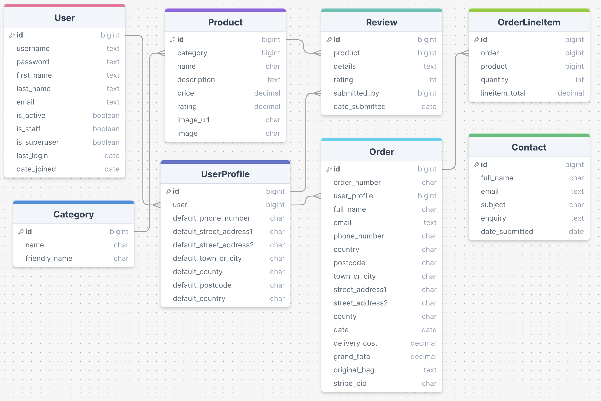

### **Wireframes**

The original wireframes for the main pages of the store can be found below. During development, a few decisions were made to change the original structure.

- **Home Page**: The welcome heading and text was moved into the main image underneath the navigation to give this area more substance and make it one of the first things the user can see upon entering the store.
- **Product Detail Page**: Instead of using Bootstrap cards to display existing review, I opted to use the Bootstrap accordion instead as the cards would be quite big, and also I could incorporate the stores color theme into the accordion in a more aesthetic way than a card. I felt the overall flow of the page was better as a result.
- **Contact Page**: A few minor label changes for the input fields, plus the addition of the company contact details should the user wish to contact them by phone, email or visit directly. These details are already in the footer, however as one of the essential pieces of information if a user needs help or advice, I felt it was a good idea to include it on the contact page as well.

<br>

<details>
<summary>Home Page</summary>
<br>
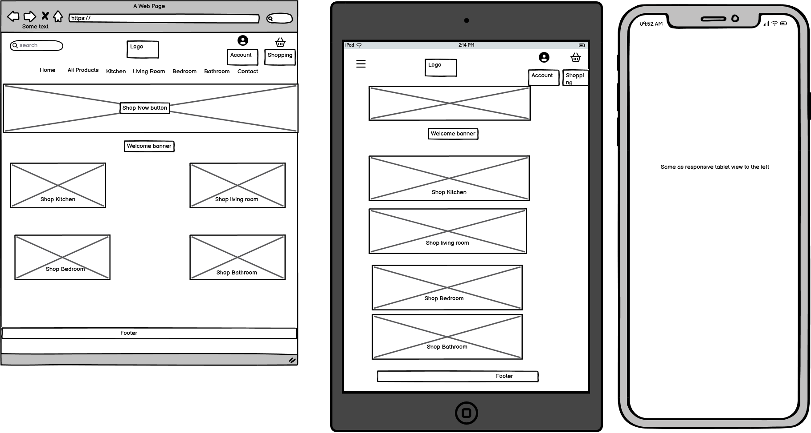
</details>
<br>

<details>
<summary>Profile Page</summary>
<br>
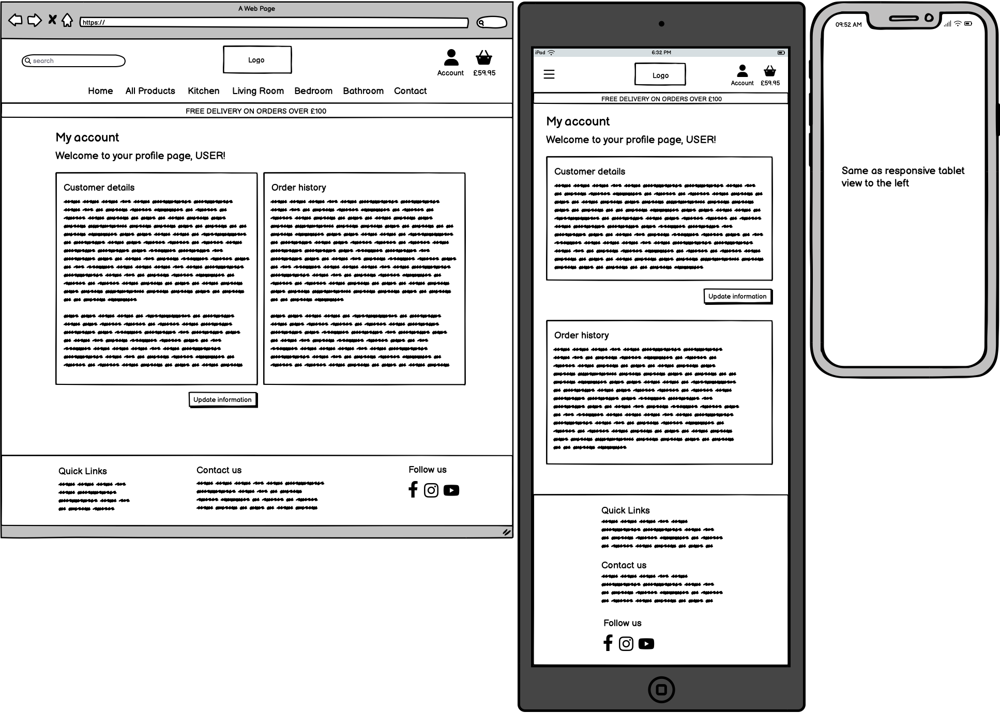
</details>
<br>

<details>
<summary>Contact Page</summary>
<br>
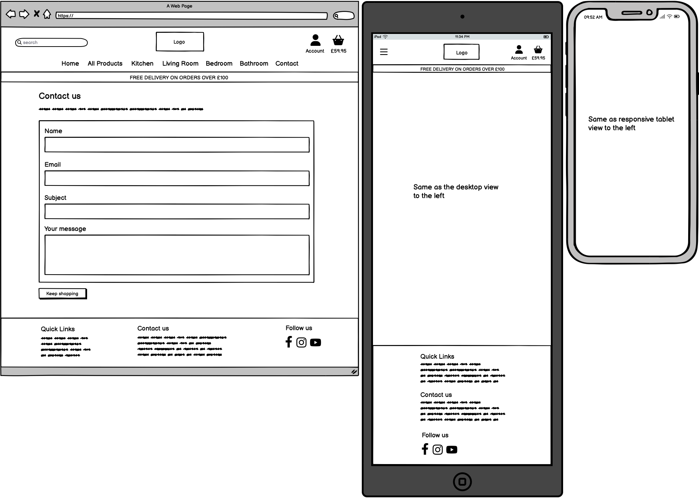
</details>
<br>

<details>
<summary>Products Page</summary>
<br>
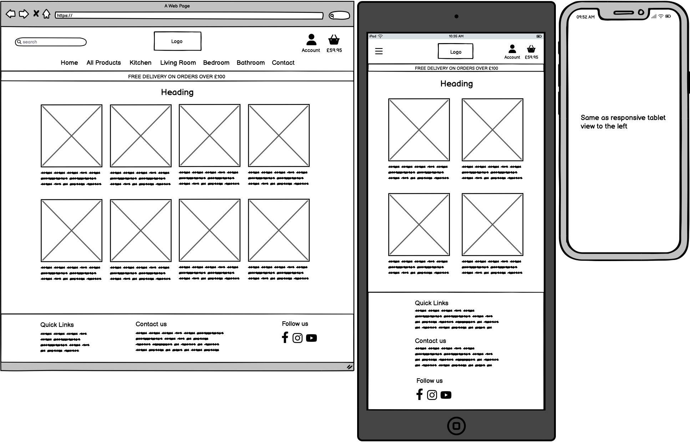
</details>
<br>

<details>
<summary>Product Detail Page</summary>
<br>
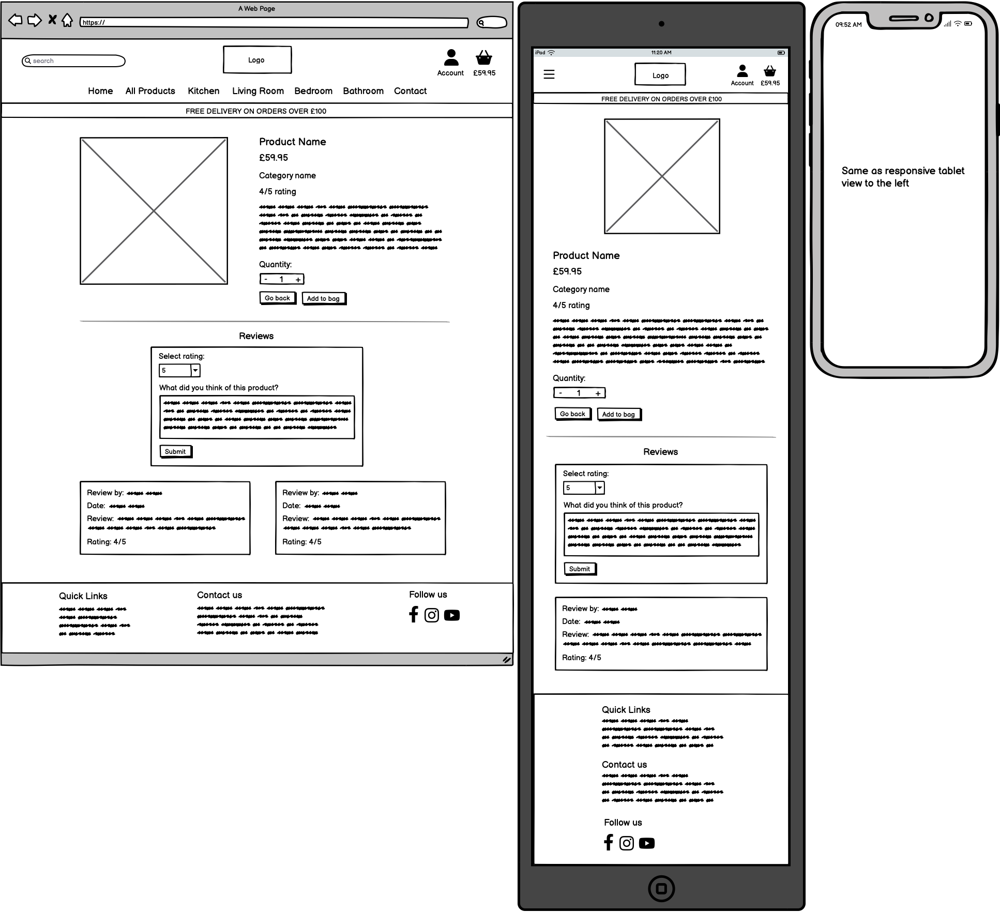
</details>
<br>

<details>
<summary>Shopping Bag</summary>
<br>
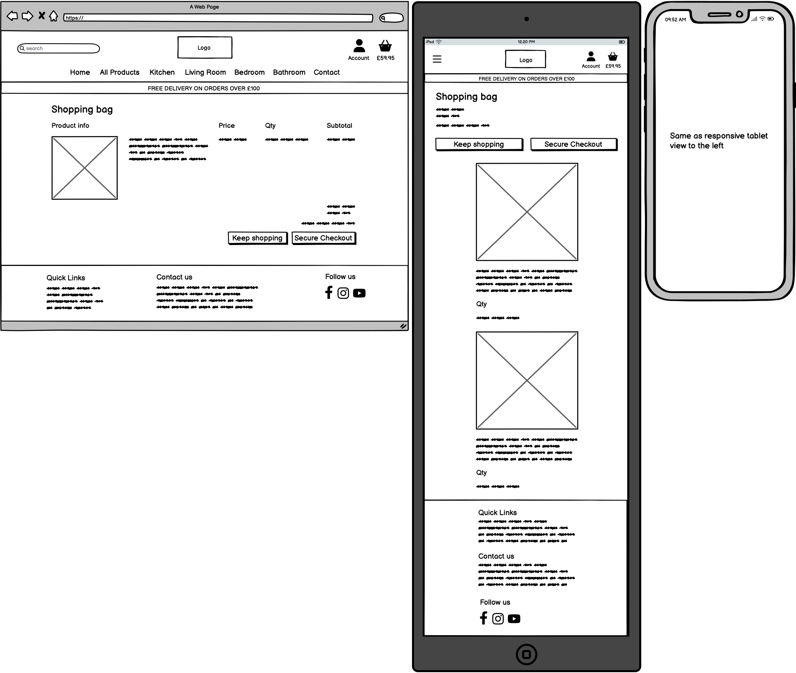
</details>
<br>

<details>
<summary>Checkout Page</summary>
<br>
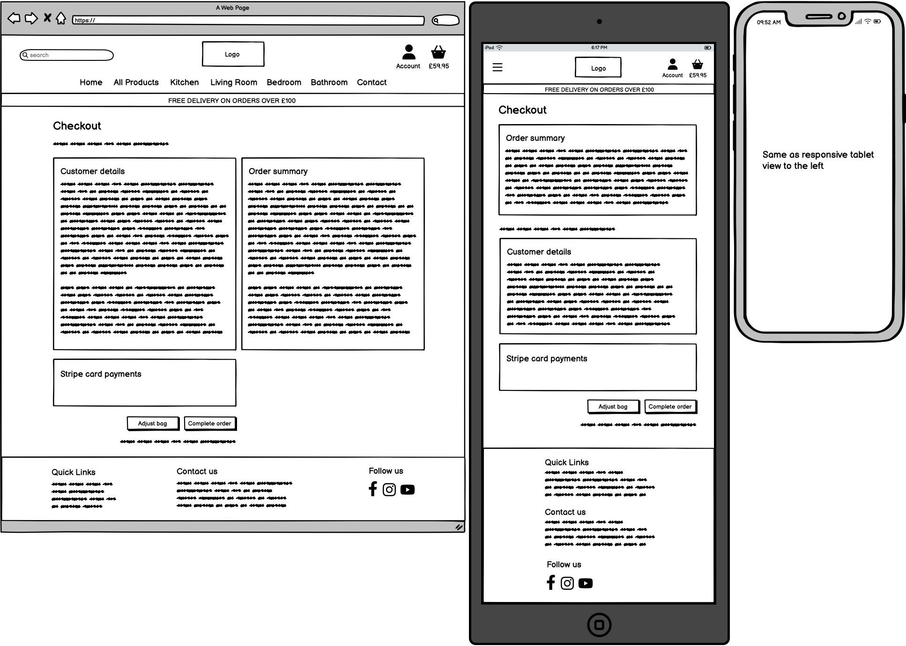
</details>
<br>

<details>
<summary>Order Confirmation Page</summary>
<br>
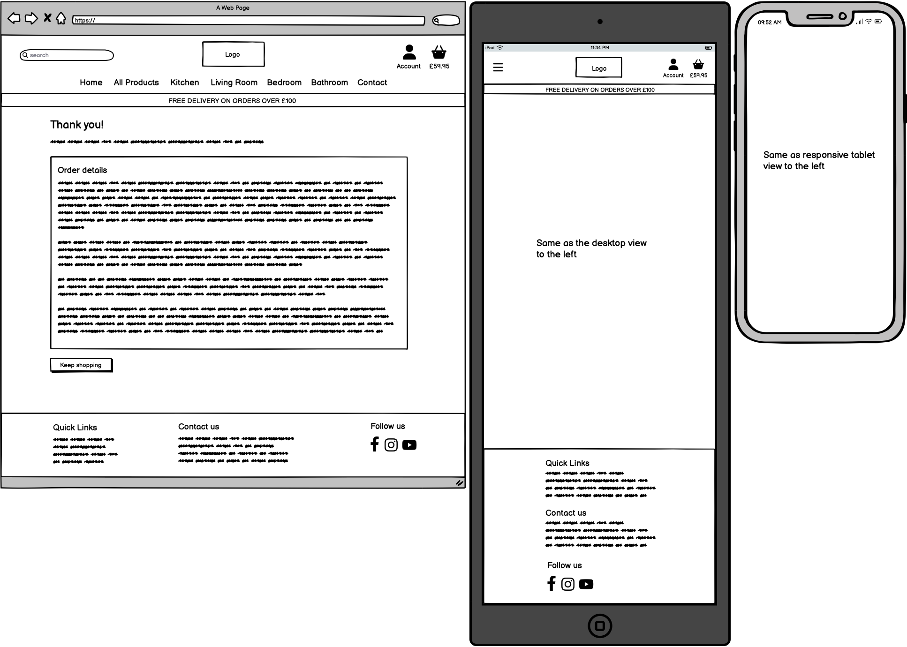
</details>

### **Color Scheme**

- Navy: #0D1B2A
- Blue: #415A77
- Black: #000
- White: #fff
- Grey: #d5d5d5 (used when hovering navigation links)

The [WCAG Color Contrast Checker](https://accessibleweb.com/color-contrast-checker/) was used to ensure that any navy/blue and white/grey combinations were suitable for use.

## **Typography**

I decided to import and use the Outfit font using Google Fonts for the store, with Helvetica and sans-serif acting as the back up fonts should the Outfit import fail.

I wanted to choose a font which wasn't mainstream and unique, but also smart and representative of the professional yet fun nature of the store. It worked well with lowercase and uppercase letters, special characters and numbers when tested on the Google platform prior to importing.

## **Features**

### **Features common to all pages**

**Navigation**

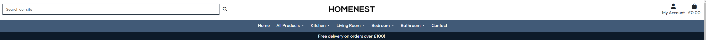

- **Search bar**: Users are able to search for products quickly and easily. If nothing is entered into the search bar but the user still clicks the search button, they receive a message informing them they didn't search for anything. The search functionality finds results that match the product name or description, to give the user the best chance of finding what they need.
- **Logo**: The In Home logo was designed to be instantly recognisable as a logo for a home store. Clicking the logo returns you to the home page.
- **My Account**: The options that appear within the dropdown that appears when My Account is clicked depend on whether or not the user is logged in, and also if the user is a superuser. If the user is not logged in, they will see register and login options. If the user is logged in, they will see my profile and logout. If the user is also a superuser, the superuser will see the add new product button.
- **Shopping Bag**: The shopping bag shows the user their current bag total, and when clicked takes them to the shopping bag page.
- **Main nav links**: The blue navigation bar contains the main site navigation allowing the user to browse through the site efficiently. A home button was included so the user can always return home regardless of where they are on the website. To find products, users can shop by category, or use the all products list to view all products, with or without a sorting choice.
- **Free delivery banner**: A free delivery banner was included to ensure the user is always aware of the minimum spend to receive free delivery. This incentivizes them to spend more if they are close to the free delivery threshold.

<br>

**Mobile Navigation**

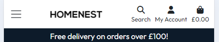

- **Burger icon**: On smaller devices, the main navigation bar is collapsed within the burger icon on the left.
- **Search**: While the search functionality for the search feature works exactly the same when used, the search bar itself appears as a dropdown when the search button is clicked on smaller devices for a better user experience.
- **Other links**: The other links including the logo, my account and shopping bag work the same as above.

<br>

**Footer**


- **Quick links**: Quick links are provided for the user so they can quickly access the products they are looking for via the footer.
- **Contact Us**: The store address, telephone number and email address are displayed on all pages so the user is able to contact the store directly very easily.
- **Social Media Links**: Social media links are displayed for users who wish to follow the store on social media via Facebook, Instagram and/or YouTube.

<br>

**Messages**

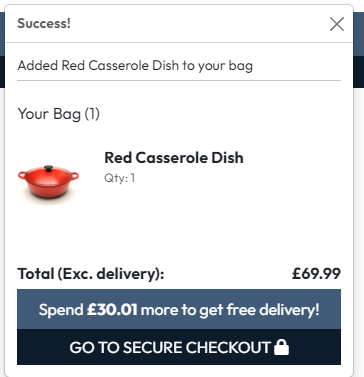

- This box appears when a message is sent to the user to inform them about a successful or unsuccessful action they have taken on the website.
- **Success message**: This message appears when the user has successfully completed an action including adding an item to their shopping bag, placing an order, submitting a contact form enquiry and logging in/out. If the user has items in their shopping bag, they will also see a link to advance to the checkout. In addition, if they haven't spent enough to qualify for free delivery, they are informed about how much more they need to spend to reach the threshold.
- **Warning message**: This message appears when the user needs to be warned about an action they have taken on the site.
- **Info message**: This message appears when the user needs to be given information about an action they have taken on the site.
- **Error message**: This message appears when the user needs to be informed of an error with an action they have taken.

### **Other Features**

**Home Page**

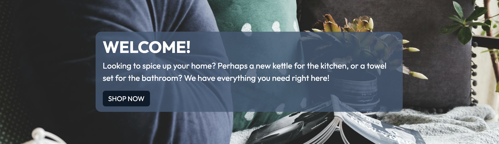

- This is one of the first things the user will see when entering the site. The wording and main image help the user to immediately understand the purpose of the website. A shop now button is included so the user can start shopping quickly and easily. This directs them to the all products page.

<br>

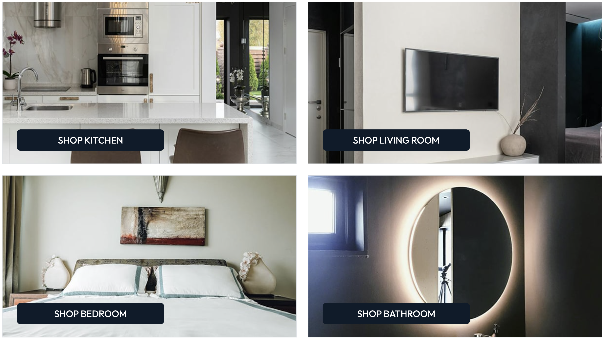

- To give the user a more specific understanding of what the store offers, the categories are neatly displayed next so the user can immediately start shopping by category if they know what area of their home they wish to buy for.

**Products page**

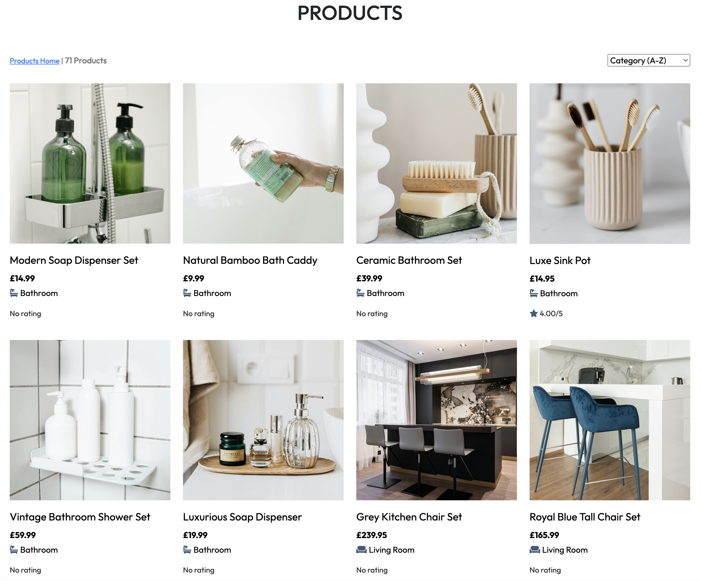

- **Sorting**: Users are able to sort products on any products page using various parameters. If sorting by rating, products with a rating are shown first, with all products without a current rating following behind.
- **Product layout**: On larger devices the site makes the most of the width showing 4 products in a single row. The amount of products in a single row reduces as the screen/device becomes smaller. Even on small devices, two products sit on a single row to stop the user from having to scroll down very far to see all products on the page. All details can be clearly seen even with two products in a single row.
- **Rating**: The product rating (if any) is calculated based as an average of all review ratings submitted for that product to date.
- **Link to product**: When hovering over the product image, name or price, the name and price are underlined to make it clear to the user that if they click now they will open the product. If they hover over the category, only the category is underlined which links to the relevant category page.

**Product detail page**

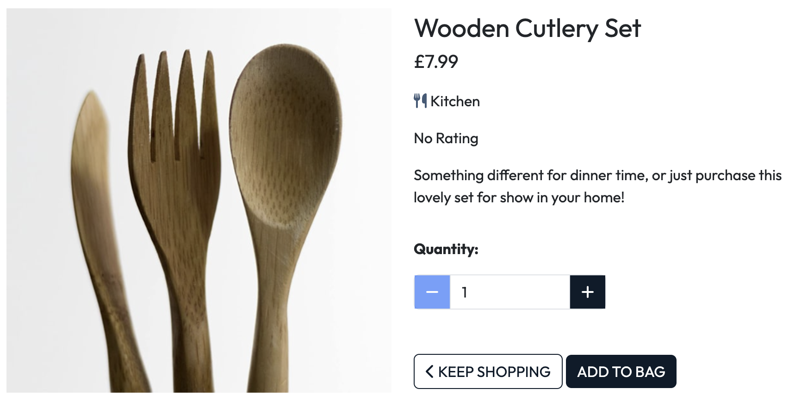

- **Image**: On click, a new tab opens showing an enlarged version of the product image.
- **Price**: The product price is very important and is clearly shown so the user can decide if they can afford to purchase the item.
- **Category**: The category which the product belongs to is displayed with a relevant icon. If clicked, the user is taken to that category to view more products if they wish.
- **Rating**: The product rating (if any) is also displayed for the user here as well as on the products page.
- **Edit/Delete product**: The superuser is shown buttons to edit and delete products, allowing them to manage product listings directly on the site rather than using the admin panel. If the user clicks delete, a modal is displayed asking if they are sure they wish to delete the product, in case they didn't mean to click it.
- **Description**: The product description provides more details about the product being views should the user want more details that aren't provided in the product name.
- **Quantity select**: The user is able to select a quantity for any product provided the value is between 1 and 99. The buttons provided to the user automatically stop them from entering a value outside of this range. If the user manually types in a value which is outside of this value and attempts to add the product to the shopping bag, they will be told to enter a value within the 1-99 range. In addition, if the user already has a given quantity of the same product in their shopping bag and attempts to add a further quantity via the product detail page which brings the shopping bag quantity above 99, they are informed that the shopping bag quantity has been set to the max value allowed of 99.
- **Buttons**: The user can go back to the products page with the keep shopping button, or add the product to their shopping bag with the add to bag button. Using the add to bag button will trigger a message to let the user know what the outcome of their action was.

**Reviews (Product detail page)**

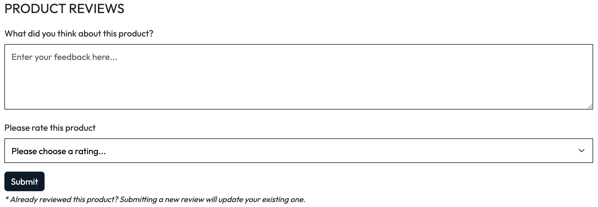

- Users who are logged in are provided with a form to leave a review for a product listed on the website. They can enter their feedback and also a product rating and submit the review to be displayed for all other users to see. The form can only be submitted if there is data entered into the feedback box and also a rating is chosen, if not the user is prompted with a pop up telling them they must do so before submitting.
- If a user has already left a review of the current product, submitting the form again will update their existing review. They are given this option in case they changed their mind about the product. This also stops a disgruntled customer from leaving multiple bad reviews, which would seriously affect the product rating unfairly.
- If the user is not logged in, the form is not displayed but they are shown a message asking them to login or register to leave a review, along with login and register links to speed the process up for them and saving them having to find the links to those pages elsewhere.
- Once a review is submitted, it is shown in the list below the form (see below for more on this).

<br>

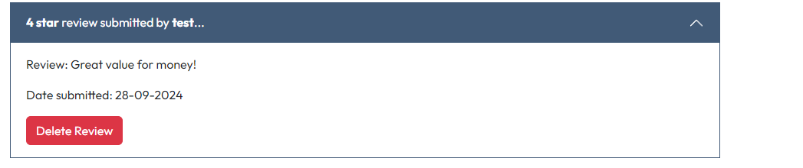

- All reviews that are submitted are shown in the reviews list below the form, for all users to see. They are stored within a Bootstrap accordion to save space on the page and organise them nicely.
- If the review belongs to the logged in user, they are able to delete it if they wish. The superuser can also delete any reviews left on the website, in case a user submits something with inappropriate language etc. If the user clicks delete, a modal is displayed asking if they are sure they wish to delete the review, in case they didn't mean to click it.
- If no reviews have been submitted, the list isn't shown and a message appears to say no reviews have been submitted yet.

**Shopping bag**

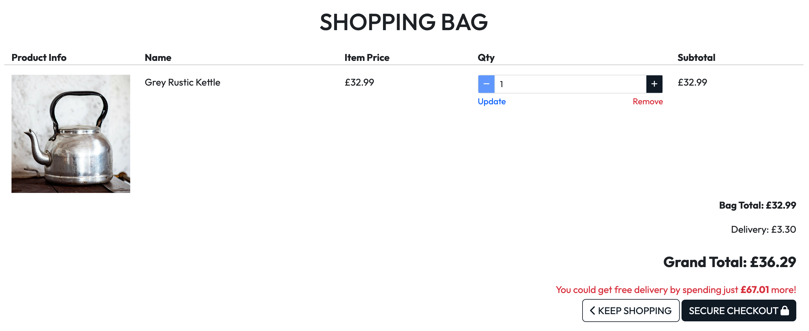

- The shopping bag page contains the items the user has added to their bag while browsing the site. If no items have been added, a message appears to tell the user the bag is empty and shows a button to go back and keep shopping.
- **Quantity / Update**: The user is able to increase and decrease the quantity of any particular item in their shopping bag and update the total using the update button. There are checks/validation in place to stop the user from generating a quantity less than 1 or greater than 99. If they try to bypass this, they are shown a message to inform them that the quantity has been set to the nearest possible quantity to their original entry attempt.
- **Remove item**: Users are also able to remove items from the shopping bag completely, using the remove button.
- **Product image**: The product image is a link to the product they click on, in case they want to go back to it.
- **Subtotal**: The subtotal for each product is automatically updated each time the user updates the quantity for that given item.
- **Free delivery threshold**: If the user is below the £100 free delivery threshold, a small red message appears to let them know how much more they can spend to get free delivery.
- **Buttons**: A button is included to keep shopping if the user wishes, otherwise they can proceed to the checkout.

**Checkout**

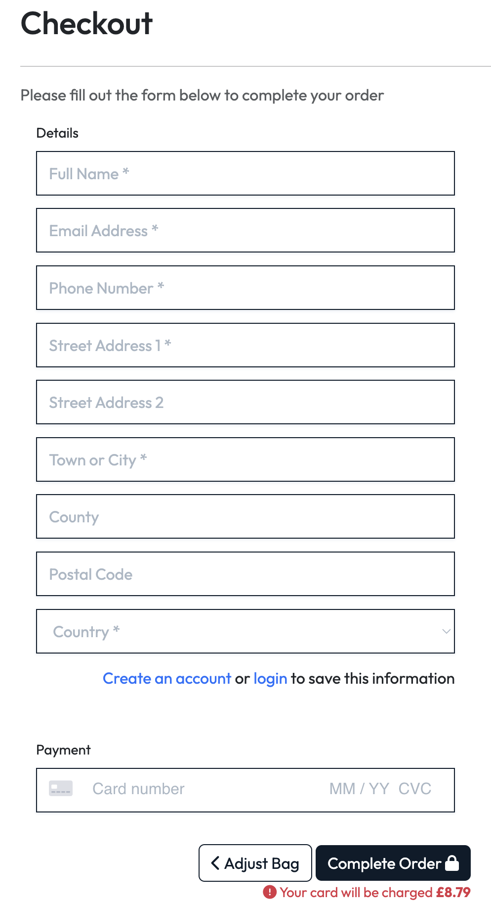

- The checkout form contains all of the required details needed from the user to process their order. Including their full name, email address and delivery information.
- **Save info**: A checkbox is included giving the user the option to save their information to their profile. If they opt for this, the next time they place an order, their details are automatically pre-filled. They can update this information on their profile page if they wish. If the user is not logged in, they are shown a message prompting them to login or register to save their information.
- **Stripe**: The store uses stripe to process it's payments. Once the complete order button is clicked, a loading spinner is displayed until the order is processed successfully, which aims to prevent the user from exiting the checkout while the store processes their payment. The user is shown a small warning message to let them know how much their card will be charged.

<br>

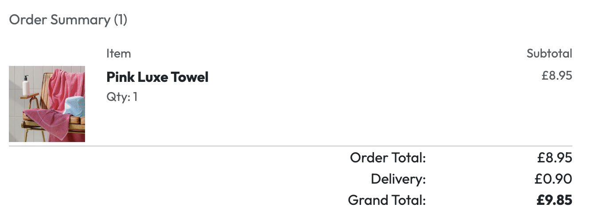

- The user is also shown a summary of their order on the checkout page, just so they are kept informed of what they are about to order. If they spot a mistake at this point, they can go back and adjust their shopping bag before completing the order and submitting payment.

**Checkout Confirmation**


- Once the user submits an order successfully, they are shown a confirmation page containing their order details, delivery and billing information.
- **Email**: A confirmation of their order is also sent to their email address containing their order details.
- **Order number**: The order number provided is unique to that particular order so it can be easily and uniquely referenced later if needed.
- **Continue Shopping**: If the user wishes to continue shopping for more products, they can use the button provided to be redirected to the products page.

<br>

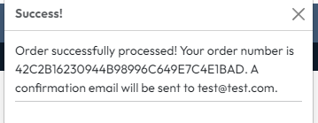

- In addition to the order confirmation provided above, and the email the user received, they are also shown a success message in the top right hand corner just to give them the extra confidence that their order was successfully submitted.

**Login page**

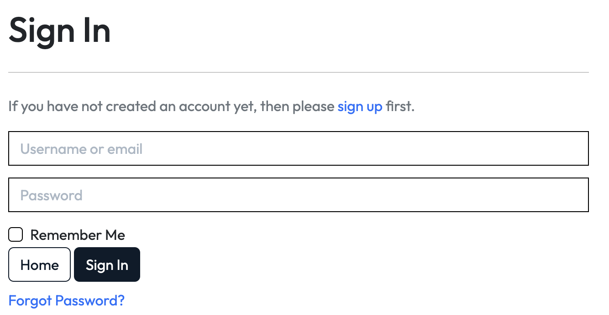

- The login page is where the user is able to login to their pre-registered account. If the user doesn't have an account already, they are able to register for one using the link provided. They can also reset their password if they can't remember it.

**Sign up page**

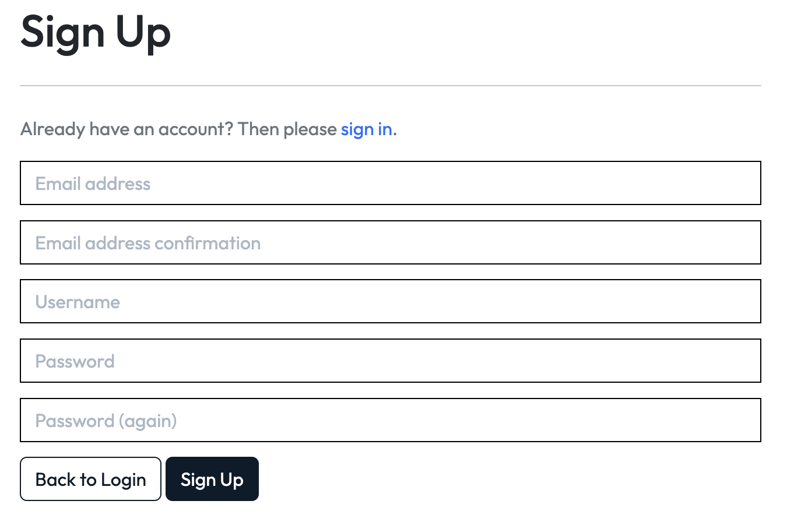

- The sign up page is where the user is able to create an account. Users must enter matching email addresses and passwords as part of the validation. The site will also inform them if they try to use a username which is already in use. If the user tries to signup for an account using an email address which is already in the database, an email will be sent to that email address to inform the person who has access to it, in case someone it trying to commit fraud.

**Password reset page**

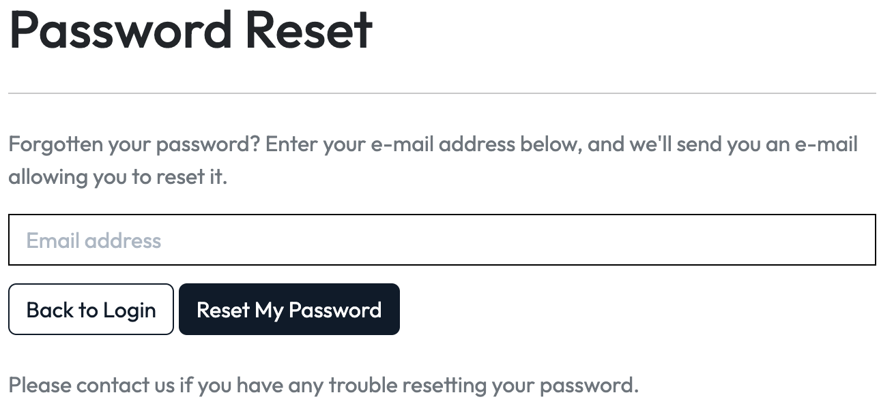

- This page allows the user to reset their password if they have forgotten it, so the user doesn't have to sign up for another account if they've just forgotten their password.

**Change password page**

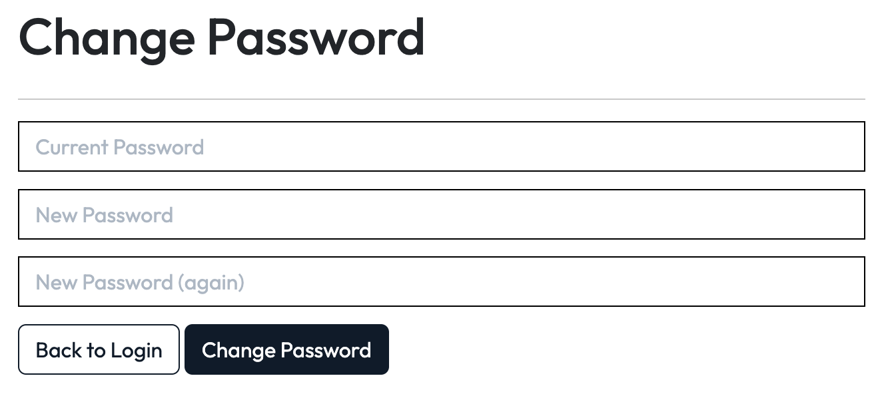

- This page allows the logged in user to change their password if they wish. This is useful if they believe someone is trying to get access to their account and personal information.

**Add a product**

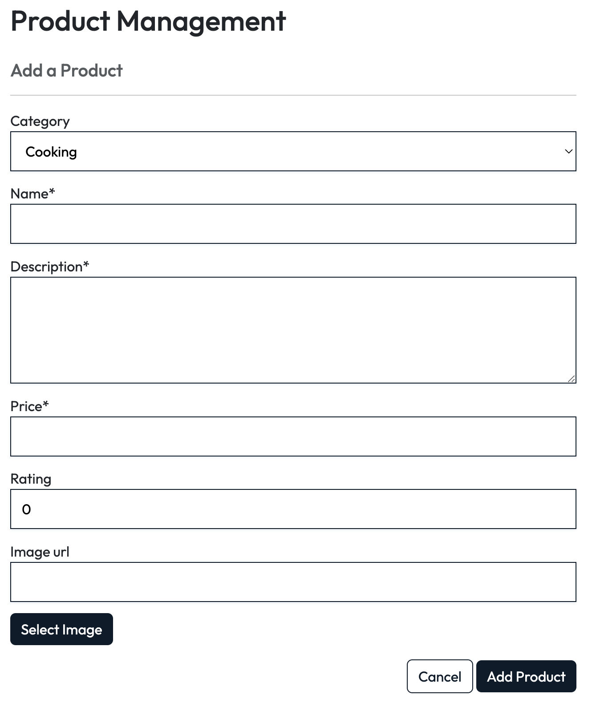

- This page is only accessible by the superuser, so customers without permission are not able to access this page via the product detail page or by entering the /products/add/ into the URL bar.
- Here, the superuser can add products to the store, selecting all of the relevant product details without having to access the admin panel.

**Edit product**

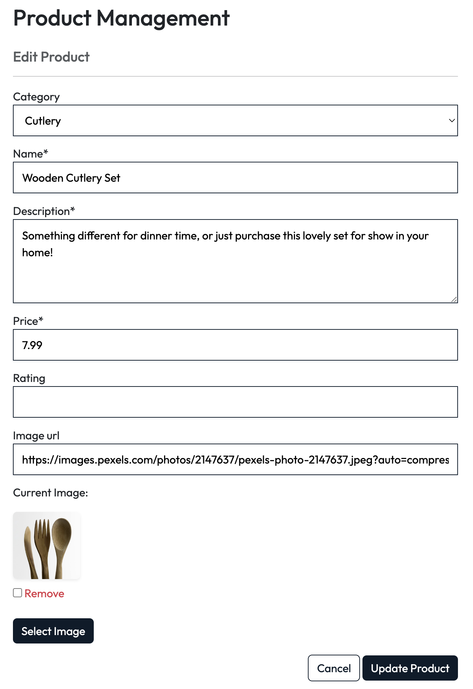

- This page is only accessible by the superuser, so customers without permission are not able to access this page via the product detail page or by entering the /products/edit/ into the URL bar.
- Here, the superuser can edit existing products in the store.

**Profile page**

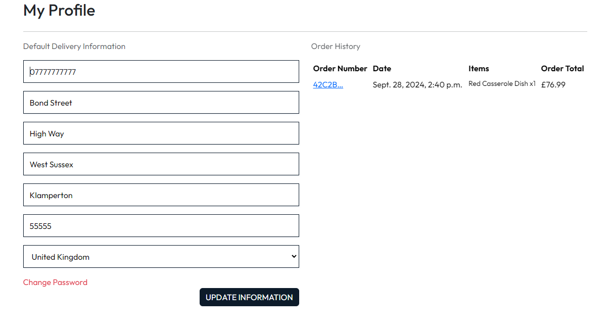

- This is the users profile page. Here they can update their personal information.
- Users can also view their past order history. By clicking on the shortened version of their order number, they are taken to a page showing their full order details in case they need to look back on what they ordered.

**Contact page**

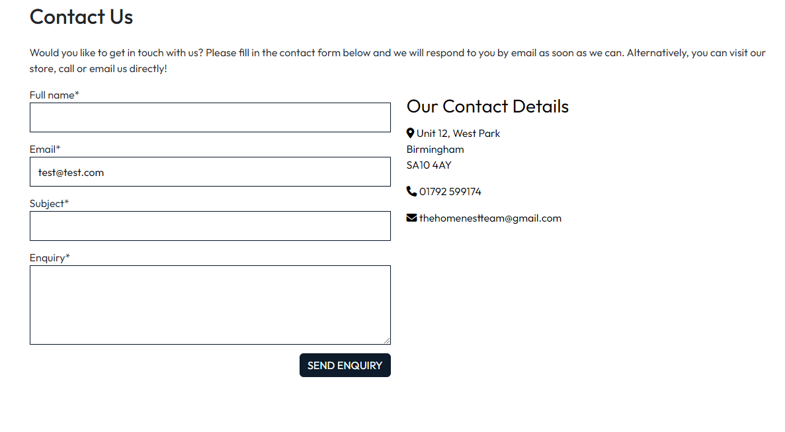

- The contact page is where the user can find multiple ways of contacting the store.
- **Contact form**: The contact form allows the user a way of submitting a message to the store for a response. It requires a name, email, subject and enquiry message and once submitted, the form is sent to the HomeNest team's email address so they can assist the customer. If the user is already logged in, their email address is automatically entered for them.
- **Contact details**: The contact page also features the company contact details, in case the user wishes to contact the store directly.

## **Future Enhancements**

Some possible enhancements which could be applied in the future include:

- A section in the users profile which displays any previous reviews they have left for products, with the option to update or delete them directly from their profile.
- A featured product section above the footer which shows on any page of the site, so the store can promote the most popular products, or products they wish to push at any given time.
- A social account login feature, so the user can login to the website using their social media account rather than an email
- A special offers section for any discounted products or special deals available
- A 'You may also like...' section at the bottom of each product which shows products the user may be interested in based on what they are currently viewing
- A 'Suggested for you' section on the users profile page which suggests products they may wish to purchase based on their previous order history
- A newsletter signup, so the store can market their products and special offers directly to interested users.
- Product images could be converted to WebP format to allow faster page loading

## **Testing Phase**

### **Responsiveness**

Responsiveness was checked and worked as intended with the following browsers and screen sizes:

- Extra Large (27" Mac Desktop):

  - Chrome
  - Safari
  - Firefox

- Large (15" MacBook Pro Laptop):

  - Chrome
  - Firefox
  - Safari

- Medium (10.9" iPad):

  - Chrome
  - Safari
  - Firefox

- Small (6" iPhone 13):

  - Chrome
  - Safari
  - Firefox

DevTools was also used to check the responsiveness at various screen sizes and devices from the list of devices available. All were fully responsive and caused no issues, including the smallest device available in the list which was a Galaxy Z Fold 5.

### **Functionality**

| Function                                             | Expectation                                                                                                                                           | Pass? |
|------------------------------------------------------|-------------------------------------------------------------------------------------------------------------------------------------------------------|-------|
| **Navigation**                                           |                                                                                                                                                       |       |
| Search Bar (with search criteria)                    | On submit, redirect to products page showing products with names or descriptions matching users criteria                                               | Yes   |
| Search Bar (no search criteria)                      | On submit, user is informed they submitted an empty search                                                                                            | Yes   |
| Logo                                                 | On click, redirect to home page                                                                                                                        | Yes   |
| My Account (logged out user)                         | On click, dropdown appears with register and login links. 'Register' directs  to the sign up page, 'Login'   to login page.                             | Yes   |
| My Account (logged in user)                          | On click, dropdown appears with profile and logout links. 'My Profile' directs to users profile page, 'Logout'  to logout confirm page.                 | Yes   |
| My Account (logged in superuser)                     | On click, superuser has same options as above plus 'Add a product' which directs them to the add product page.                                          | Yes   |
| Shopping Bag                                         | On click, takes user to the shopping bag page.                                                                                                         | Yes   |
| Shopping Bag Total                                   | Default value shown is £0.00 unless user has items in their shopping bag, in which case amount shown should reflect the bag total.                      | Yes   |
| Home Nav Link                                        | On click, takes user to the home page.                                                                                                                 | Yes   |
| All Products Nav Link                                | On click, dropdown appears with relevant options, all linking to their relevant pages.                                                                 | Yes   |
| Kitchen Nav Link                                     | On click, dropdown appears with relevant options, all linking to their relevant pages.                                                                 | Yes   |
| Living Room Nav Link                                 | On click, dropdown appears with relevant options, all linking to their relevant pages.                                                                 | Yes   |
| Bedroom Nav Link                                     | On click, dropdown appears with relevant options, all linking to their relevant pages.                                                                 | Yes   |
| Bathroom Nav Link                                    | On click, dropdown appears with relevant options, all linking to their relevant pages.                                                                 | Yes   |
| Contact Nav Link                                     | On click, takes user to the contact page.                                                                                                               | Yes   |
| **Footer**                                               |                                                                                                                                                       |       |
| Quick Links                                          | On click, each link takes the user to the relevant page.                                                                                               | Yes   |
| Telephone Number                                     | On click, the site attempts to start a phone call direct to the store.                                                                                  | Yes   |
| Email                                                | On click,  the store attempts to start an email direct to the store via the users default email provider.                                               | Yes   |
| Social Media Links                                   | On click, user is directed to the relevant social media platform.                                                                                      | Yes   |
| **Home Page**                                            |                                                                                                                                                       |       |
| Shop Now                                             | On click, takes user to the all products page.                                                                                                         | Yes   |
| Kitchen Category Image                               | On click (on the image or the button), takes user to the kitchen products page.                                                                        | Yes   |
| Living Room Category Image                           | On click (on the image or the button), takes user to the living room products page.                                                                    | Yes   |
| Bedroom Category Image                               | On click (on the image or the button), takes user to the bedroom products page.                                                                        | Yes   |
| Bathroom Category Image                              | On click (on the image or the button), takes user to the bathroom products page.                                                                       | Yes   |
| **Products Page**                                        |                                                                                                                                                       |       |
| Link to product detail                               | For each product shown, the product image, name and price all link to that products detail page.                                                       | Yes   |
| Link to category                                     | For each product shown, the products category shown links to the category that product belongs to.                                                     | Yes   |
| Sorting by price                                     | Sorting  low to high displays the products in ascending order by price, and high to low in descending order.                                           | Yes   |
| Sorting by name                                      | Sorting  A-Z displays the products in alphabetical order by name, and Z-A in the reverse order.                                                        | Yes   |
| Sorting by rating                                    | Sorting  low to high displays the products in ascending order by rating, and high to low in descending order. Products with  ratings are always displayed first. | Yes   |
| Sorting by category                                  | Sorting  A-Z displays the products in alphabetical order by category, and Z-A in the reverse order.                                                    | Yes   |
| Products Home                                        | On click, products Home link directs the user to the all products page                                                                                 | Yes   |
| Products total                                       | Total number of products matches total number actually shown on page                                                                                   | Yes   |
| Products (search query)                              | When user is taken to the products page from a search query, page confirms how many products were found based on their search criteria.                 | Yes   |
| **Product Detail Page**                                  |                                                                                                                                                       |       |
| Image                                                | On click, image opens in a new tab                                                                                                                     | Yes   |
| Category                                             | On click, user is directed to the category in which the product belongs to                                                                             | Yes   |
| Edit (superuser only)                                | When superuser is logged in, edit link is shown which directs superuser to the edit product page                                                       | Yes   |
| Delete (superuser only)                              | When superuser is logged in, delete link is shown which prompts the delete product modal. The delete button deletes the product                        | Yes   |
| Quantity Decrease (-)                                | On click, quantity is reduced by 1 (unless quantity is already 1, then decrease button is disabled)                                                    | Yes   |
| Quantity Increase (+)                                | On click, quantity is increased by 1 (unless quantity is 99, then increase button is disabled)                                                         | Yes   |
| Quantity input, manual entry                         | If a quantity below 1 or above 99 is manually entered, user is told to enter a valid quantity when attempting to add the product to the bag             | Yes   |
| Keep shopping                                        | On click, user is directed to the all products page                                                                                                    | Yes   |
| Add to bag (product not already in bag)              | On click, product is added to the users shopping bag in the desired quantity, with success message confirming the action and a button to proceed to the checkout. Bag total to update at top of page | Yes   |
| Add to bag (product already in bag)                  | If product already in users bag and a further quantity is added making the new quantity above 99, bag quantity is set to 99 and user is informed. Otherwise, update bag quantity & total accordingly. | Yes   |
| Product Review Form (logged in user)                 | For logged in users, product review form to be displayed and only submitted when feedback is entered and a rating is selected.                          | Yes   |
| Product Review Form (user not logged in)             | Form is hidden and prompt for user to either login or register for an account is displayed.                                                            | Yes   |
| Product Review Form Submission                       | On submit (provided validation criteria is met), review is added to the reviews accordion style list below.                                             | Yes   |
| Product reviews                                      | If no reviews have been submitted for that product yet, message is displayed to that effect. Otherwise, reviews are stacked in a collapsable list.     | Yes   |
| Product reviews, delete                              | When viewing a review, if it belongs to the logged in user or a superuser is logged in, delete button appears which prompts the delete review modal. Clicking the modals delete button deletes the review. | Yes   |
| **Shopping Bag page**                                    |                                                                                                                                                       |       |
| No products                                          | If no products are currently in the shopping bag, user is informed their bag is empty and provided with a keep shopping button which directs them to the all products page. | Yes   |
| Products in bag                                      | If products are in the shopping bag, each products image, name, price, quantity and subtotal is shown                                                  | Yes   |
| Product image                                        | Product image directs user to that particular product                                                                                                  | Yes   |
| Update quantity (outside of 1-99 range)              | Update quantity to include same validation checks as on the product detail page to ensure quantity is always between 1 and 99. Message appear to inform the user if they try to go outside of the range | Yes   |
| Update quantity (inside of 1-99 range)               | On click, quantity, subtotal, bag total and grand total to be updated accordingly. Delivery total to be updated if under free delivery threshold        | Yes   |
| Remove                                               | On click, product is removed from the bag. Bag total and grand total updated accordingly (or revert to no products in bag message if last product is removed). If now below free delivery threshold, delivery total updated accordingly. | Yes   |
| Keep shopping                                        | On click, direct user to all products page                                                                                                             | Yes   |
| Secure checkout                                      | On click, direct user to checkout page                                                                                                                 | Yes   |
| **Checkout page**                                        |                                                                                                                                                       |       |
| Pre filled details                                   | If user is logged in and profile information is saved, customers details are pre-filled accordingly.                                                   | Yes   |
| Save delivery information (logged in user)           | If user is logged in, checkbox to save delivery information is shown. Once order is placed, delivery information on profile page is updated.            | Yes   |
| Save delivery information (user not logged in)       | If user is logged is not logged in, prompt to login or register appears taking them to the relevant pages.                                              | Yes   |
| Adjust bag                                           | On click, direct user back to the shopping bag                                                                                                          | Yes   |
| Charge warning                                       | Red warning message for charge amount to match the grand total on same page.                                                                           | Yes   |
| Product image                                        | Product image in order summary to link to product page                                                                                                 | Yes   |
| Complete order                                       | On click, loading spinner appears while order is processed. If order is successful, direct user to order confirmation page and success message appears. Clear shopping bag and reset bag total to £0.00 | Yes   |
| Complete order continued                             | With successful order, if user is logged in, add order to order history on profile page and sent confirmation of order to users email address           | Yes   |
| **Order confirmation page**                              |                                                                                                                                                       |       |
| Order details                                        | All order details shown to match those that were entered originally. Unique order number assigned to the order                                         | Yes   |
| Missed something                                     | Missed something button to direct user to all products page                                                                                            | Yes   |
| **Profile page**                                         |                                                                                                                                                       |       |
| Delivery information                                 | If user has previously saved delivery info via checkout page or previously saved via profile page, details are pre-populated.                          | Yes   |
| Change password                                      | On click, direct user to change password page                                                                                                          | Yes   |
| Update information                                   | On click, update any changed details in form above                                                                                                     | Yes   |
| Order history                                        | All previous orders to be displayed, with order number acting as a link to order page. When clicked, message to appear informing user they are viewing an existing order | Yes   |
| **Logout Page**                                          |                                                                                                                                                       |       |
| Cancel                                               | On click, directs user to Home page and user is not logged out                                                                                         | Yes   |
| Sign out                                             | On click, logs the user out, message appears to confirm and user is directed to the home page                                                          | Yes   |
| **Sign Up/Register Page**                                |                                                                                                                                                       |       |
| Sign in link                                         | On click, directs user to login page                                                                                                                   | Yes   |
| Email validation                                     | On submit/sign up, if email address doesn’t match email address confirmation field, user is informed must retry with correct details                   | Yes   |
| Username validation                                  | On submit/sign up, if username already exists, user is informed to make another choice                                                                 | Yes   |
| Password validation                                  | On submit/sign up, if passwords don't match or meet the minimum criteria, user is informed with instructions as to what they must do to meet criteria  | Yes   |
| Back to login                                        | On click, directs user to login page                                                                                                                   | Yes   |
| Sign up                                              | On click, if all validation checks pass, user is sent an email to confirm their email address and registration. Once confirmed, account is created and user can login. | Yes   |
| Sign up (email already registered)                   | As above, but email to user mentions that someone has tried to create an account using their email, but an account already exists.                     | Yes   |
| **Login page**                                           |                                                                                                                                                       |       |
| Signup link                                          | On click, directs user to sign up/register page                                                                                                        | Yes   |
| Home button                                          | On click, directs user to the home page                                                                                                                | Yes   |
| Sign in                                              | On click, if username/email and password match a users details stored in database, log the user in with success message                               | Yes   |
| Forgot password                                      | On click, directs user to reset password page                                                                                                          | Yes   |
| **Change password page**                                 |                                                                                                                                                       |       |
| Back to login                                        | On click, directs user to login page                                                                                                                   | Yes   |
| Change password                                      | On click, update the users password if current password matches current password currently stored in database and new password and new password (again) both match | Yes   |
| **Reset password page**                                  |                                                                                                                                                       |       |
| Back to login                                        | On click, directs user to login page                                                                                                                   | Yes   |
| Reset my password                                    | On click, send password reset email to users email                                                                                                     | Yes   |
| **Contact page**                                         |                                                                                                                                                       |       |
| Contact form                                         | If user is logged in, email is pre-populated. On submit, if all fields are completed and match validation criteria, user is directed to home page and shown success message. Contact form is sent to In Home email address for a response | Yes   |
| **Add product page (superuser only)**                    |                                                                                                                                                       |       |
| Select image                                         | On click, opens image select window on users device. When image is selected and confirmed, message appears to user to let them know what the image will be set to. | Yes   |
| Cancel                                               | On click, direct user to all products page                                                                                                             | Yes   |
| Add product                                          | On click, provided required fields are completed/entered, add new product to store                                                                     | Yes   |
| Access                                               | If any user other than the superuser attempts to access the add product page, they are informed they can't access it                                    | Yes   |
| **Edit product page (superuser only)**                   |                                                                                                                                                       |       |
| On load                                              | Info message to inform superuser what product they are editing                                                                                        | Yes   |
| Pre-filled details                                   | Existing product details pre-filled in relevant fields                                                                                                 | Yes   |
| Select image                                         | On click, opens image select window on users device. When image is selected and confirmed, message appears to user to let them know what the image will be set to. | Yes   |
| Remove image                                         | On submit (update), if ticked, image is removed from the product                                                                                       | Yes   |
| Cancel                                               | On click, direct user to all products page                                                                                                             | Yes   |
| Update product                                       | On click, provided required fields are completed/entered, update existing product details                                                              | Yes   |
| Access                                               | If any user other than the superuser attempts to access the edit product page, they are infomred they can't access it                                   | Yes   |
| **404 page not found**                                   |                                                                                                                                                       |       |
| Page not found                                       | For any 404 page not found errors, direct user to custom 404 error page                                                                                | Yes   |
| **500 error page**                                       |                                                                                                                                                       |       |
| 500 server error page                                | For any 500 server errors, direct user to custom 500 error page                                                                                        | Yes   |

### **Validators**

**HTML Validators**

The following files were passed through the [W3C HTML Validator](https://validator.w3.org/) and passed with no errors. Please note, to test each file, the complete HTML via the page source on the front end of each page was passed through the direct input section of the validator, thus avoiding errors due to the django statements.

| File                         | Pass?  |
|------------------------------|--------|
| bag-total.html               | Yes    |
| bag.html                     | Yes    |
| checkout-buttons.html        | Yes    |
| checkout_success.html        | Yes    |
| checkout.html                | Yes    |
| contact.html                 | Yes    |
| index.html                   | Yes    |
| quantity_input_script.html   | Yes    |
| add_product.html             | Yes    |
| edit_product.html            | Yes    |
| product_detail.html          | Yes    |
| products.html                | Yes    |
| profile.html                 | Yes    |
| toast_error.html             | Yes    |
| toast_info.html              | Yes    |
| toast_success.html           | Yes    |
| toast_warning.html           | Yes    |
| footer.html                  | Yes    |
| main-nav.html                | Yes    |
| mobile-top-header.html       | Yes    |
| 404.html                     | Yes    |
| 500.html                     | Yes    |
| base.html                    | Yes    |
| signup.html                  | Yes    |
| login.html                   | Yes    |
| password_change.html         | Yes    |
| password_reset.html          | Yes    |

**CSS Validator**

The following files were passed through the [W3C CSS Validator](https://jigsaw.w3.org/css-validator/) and passed with no errors.

| File                       | Pass?  |
|----------------------------|--------|
| checkout.css               | Yes    |
| profile.css                | Yes    |
| base.css                   | Yes    |

**JSHint**

The [JSHint](https://jshint.com/) javascript validator was used to check the javascript used within the store. All files below passed with no errors.

| File                                       | Pass?  |
|--------------------------------------------|--------|
| bag.html (script at the bottom)            | Yes    |
| stripe_elements.js                         | Yes    |
| quantity_input_script.html                 | Yes    |
| add_product.html (script at the bottom)    | Yes    |
| edit_product.html (script at the bottom)   | Yes    |
| products.html (script at the bottom)       | Yes    |
| base.html (script at the bottom)           | Yes    |

**CI Python Linter**

All python files were passed through the [CI Python Linter](https://pep8ci.herokuapp.com/) and all passed with no errors found.

| App                          | File                  | Pass?  |
|------------------------------|-----------------------|--------|
| bag > templatetags           | bag_tools             | Yes    |
| bag                          | admin                 | Yes    |
| bag                          | apps                  | Yes    |
| bag                          | contexts              | Yes    |
| bag                          | models                | Yes    |
| bag                          | urls                  | Yes    |
| bag                          | views                 | Yes    |
| checkout                     | admin                 | Yes    |
| checkout                     | apps                  | Yes    |
| checkout                     | forms                 | Yes    |
| checkout                     | models                | Yes    |
| checkout                     | signals               | Yes    |
| checkout                     | urls                  | Yes    |
| checkout                     | views                 | Yes    |
| checkout                     | webhook_handler       | Yes    |
| checkout                     | webhooks              | Yes    |
| contact                      | admin                 | Yes    |
| contact                      | apps                  | Yes    |
| contact                      | forms                 | Yes    |
| contact                      | models                | Yes    |
| contact                      | urls                  | Yes    |
| contact                      | views                 | Yes    |
| home                         | admin                 | Yes    |
| home                         | apps                  | Yes    |
| home                         | models                | Yes    |
| home                         | urls                  | Yes    |
| home                         | views                 | Yes    |
| in_home                      | asgi                  | Yes    |
| in_home                      | settings              | Yes    |
| in_home                      | urls                  | Yes    |
| in_home                      | wsgi                  | Yes    |
| products > templatetags      | custom_filters        | Yes    |
| products                     | admin                 | Yes    |
| products                     | apps                  | Yes    |
| products                     | forms                 | Yes    |
| products                     | models                | Yes    |
| products                     | urls                  | Yes    |
| products                     | views                 | Yes    |
| products                     | widgets               | Yes    |
| profiles                     | admin                 | Yes    |
| profiles                     | apps                  | Yes    |
| profiles                     | forms                 | Yes    |
| profiles                     | models                | Yes    |
| profiles                     | urls                  | Yes    |
| profiles                     | views                 | Yes    |
| custom_storages              | custom_storages       | Yes    |
| manage                       | manage                | Yes    |

**WAVE Accessibility Checker**

The [WAVE Accessibility Checker](https://wave.webaim.org/) was used on each page of the store to ensure it is accessible as possible. All pages passed with no errors or contrast errors, apart from the following all auth pages provided by the Django framework:

- Login/Sign In
- Register/Sign Up
- Change password (when logged in)
- Reset password (when logged out)

The errors were suggesting that the input fields on these pages did not include corresponding labels. However, on click the WAVE tool points to each potential error within your code and upon inspection, each input field included a matching label. The input fields themselves include a placeholder.

**Lighthouse**

PLACEHOLDER NEEDS TESTS

### **Testing user stories**

**User story 1**: As a new user, I want to immediately understand the site's purpose.

**Achieved?**: Yes. Upon entering the site, you are greeted with a welcome message summarising what the store sells along with a prompt to start shopping. The logo has also been designed to make it as clear as possible what the store is about, which is shown on every page of the site.

**User story 2**: As a new user, I want to easily navigate the website.

**Achieved?**: Yes. The navigation bar includes links to all pages on both desktop and mobile devices, so users are able to find what they need quickly and easily.

**User story 3**: As a new user, I want to browse all available products.

**Achieved?**: Yes. The store includes an 'All Products' section where they can view all available products, which is accessible on all devices. Browsing is made easier with options to sort by various different parameters.

**User story 4**: As a new user, I want to filter products to quickly find what I need.

**Achieved?**: Yes. Users are able to shop by category so they are able to find what they are looking for quickly and easily. 

**User story 5**: As a new user, I want to search for products

**Achieved?**: Yes. Users can search for products on all devices by using the search bar, which returns results quickly based on their input.

**User story 6**: As a new user, I want to contact the company for help or advice

**Achieved?**: Yes. The site includes a contact page where the user can submit an enquiry form to receive a response from the store. Contact details are also included, if they wish to contact the company directly themselves for an even faster response.

**User story 7**: As a new user, I want to purchase products without registering for an account

**Achieved?**: Yes. Users are able to place orders without having to register for an account.

**User story 8**: As a new user, I want to browse product reviews left by other users

**Achieved?**: Yes. Users are able to view product reviews without an account via the product detail page for the product they are interested in.

**User story 9**: As a new user, I want to stay informed on actions I take throughout the website

**Achieved?**: Yes. The user is kept informed as to whether their actions were successful or not via the messages that appear at the top right corner of the screen. Confirmation messages are included for all important actions, including adding items to the bag, placing orders and logging in or out (to name a few).

**User story 10**: As a new user, I want to receive confirmation of my order

**Achieved?**: Yes. Once an order is placed, the user is directed to a confirmation page telling them their order has been successfully placed. They will also receive an email with confirmation of their order.

**User story 11**: As a new user, I want to access the site on any device

**Achieved?**: Yes. The site is fully responsive and can be accessed on any device. In addition to testing the site on multiple devices with different screen sizes, the site was also tested using devtools with the smallest mobile device available in the list, the Galaxy Z Fold 5.

**User story 12**: As a new user, I want to create and log into an account

**Achieved?**: Yes. Users are able to create / login to their account via the 'My Account' button at the top of the screen, available on every page of the website. In addition, there are several prompts to either create and account or login to an existing account throughout the website on specific pages where relevant.

**User story 13**: As a registered user, I want to view my profile page

**Achieved?**: Yes. All registered users are provided with a profile page which can be viewed when they login.

**User story 14**: As a registered user, I want to view my previous order history

**Achieved?**: Yes. The user is able to see their previous order history on their profile page.

**User story 15**: As a registered user, I want to view and update my personal information

**Achieved?**: Yes. The user is able to view and update their personal information on their profile page.

**User story 16**: As a registered user, I want to create reviews for products I've purchased

**Achieved?**: Yes. Once logged in, users are able to create reviews for any product found within the store at the bottom of the product detail page for the product they are viewing.

**User story 17**: As a registered user, I want to view reviews for products I've purchased

**Achieved?**: Yes. Users are able to view reviews submitted by themselves or other users for any product found within the store at the bottom of the product detail page for the product they are viewing.

**User story 18**: As a registered user, I want to update reviews for products I've purchased

**Achieved?**: Yes. Users can update their existing reviews by submitting a new review for the same product as the existing review, which will overwrite / update it.

**User story 19**: As a registered user, I want to delete reviews for products I've purchased

**Achieved?**: Yes. Users can delete their existing reviews by clicking the delete button found within the review of the product they have submitted the review for.

**User story 20**: As a registered user, I want to change my password

**Achieved?**: Yes. Users can update their password via the profile page, or if they have forgotten it they can click the forgotten password link on the login page to reset it.

**User story 21**: As a registered user, I want to make purchases without filling in my personal information each time

**Achieved?**: Yes. Users are given the option to save their personal information in the checkout when completing an order, so it's saved to their profile and will be automatically filled in next time they order. They can also go to their profile and enter / update their information.

**User story 22**: As a registered user, I want to logout of my account

**Achieved?**: Yes. Users can logout of their account by clicking the logout button within the my account section at the top of the page.

**User story 23**: As an admin, I want to add new products to the store

**Achieved?**: Yes. Admin users are able to add new products to the store via the 'Add a product' button within the 'My Account' tab at the top of the page.

**User story 24**: As an admin, I want to update existing products

**Achieved?**: Yes. Admin users are able to update existing products via the 'Edit' button found on the product details page for the product to be edited.

**User story 25**: As an admin, I want to delete existing products

**Achieved?**: Yes. Admin users are able to delete existing products via the 'Delete' button found on the product details page for the product to be deleted.

**User story 26**: As an admin, I want to delete existing reviews

**Achieved?**: Yes. Admin users are able to delete existing reviews that belong to any user via the 'Delete Review' button found within the review itself on the product detail page.

## **Bugs**

I found the following bugs during the development process:

- Toasts
  - Problem: Toast messages not showing when user takes an action which should display a message.
  - Cause: Jquery doesn't recognise the toast() function based on the Bootstrap version being used
  - Solution: Replaced it with vanilla javascript which worked with the Bootstrap version being used

  ---

## **Deployment**

To deploy this Django project, follow the steps below.

### **Prerequisites**

Ensure you have the following:

- Python
- Git
- Heroku account
- Amazon Web Services (AWS) account
- Stripe account
- Gmail account for SMTP

### **Installation**

1. Clone the repository from GitHub:

    ```
    git clone https://github.com/lewis-creates/homenest.git
    cd in-home
    ```

2. Set up the virtual environment in terminal:

    ```
    python -m venv env
    . env/bin/activate
    ```

3. Install the project dependencies:

    ```
    pip install -r requirements.txt
    ```

4. Create an env.py file in the root directory of the project for your environment variables using the example template below:

    ```
    import os

    os.environ['SECRET_KEY'] = 'your_secret_key'
    os.environ['DATABASE_URL'] = 'your_database_url'
    os.environ['AWS_ACCESS_KEY_ID'] = 'your_aws_access_key_id'
    os.environ['AWS_SECRET_ACCESS_KEY'] = 'your_aws_secret_access_key'
    os.environ['STRIPE_PUBLIC_KEY'] = 'your_stripe_public_key'
    os.environ['STRIPE_SECRET_KEY'] = 'your_stripe_secret_key'
    os.environ['EMAIL_HOST_USER'] = 'your_email'
    os.environ['EMAIL_HOST_PASSWORD'] = 'your_email_password'
    ```

5. Ensure env.py and the other following files are included in your .gitignore file to keep them hidden:

    ```
    *.pyc
    __pycache__/
    env.py
    ```

### **Configuring AWS for Media and Static Files**

- Log in to your AWS account and create an S3 bucket for storing your media and static files.
- Configure the bucket to allow public access.
- Update your Django settings to use django-storages and boto3 for managing static and media files.
- Add the following configurations to your settings.py:

    ```
    AWS_STORAGE_BUCKET_NAME = 'your_bucket_name'
    AWS_S3_REGION_NAME = 'your_region'  # e.g., 'us-east-1'
    AWS_ACCESS_KEY_ID = os.environ.get('AWS_ACCESS_KEY_ID')
    AWS_SECRET_ACCESS_KEY = os.environ.get('AWS_SECRET_ACCESS_KEY')

    AWS_S3_CUSTOM_DOMAIN = f'{AWS_STORAGE_BUCKET_NAME}.s3.amazonaws.com'

    STATICFILES_STORAGE = 'storages.backends.s3boto3.S3Boto3Storage'
    DEFAULT_FILE_STORAGE = 'storages.backends.s3boto3.S3Boto3Storage'

    STATIC_URL = f'https://{AWS_S3_CUSTOM_DOMAIN}/static/'
    MEDIA_URL = f'https://{AWS_S3_CUSTOM_DOMAIN}/media/'
    ```

### **Setting Up Stripe**

- Obtain your Stripe API keys from the dashboard.
- Add these keys to your env.py file.

### **Configuring Gmail for SMTP**

Gmail settings:

  - Go to your Gmail account and click account settings
  - Click 'Accounts and Import', then 'Other Google Account Settings' and then 'Security'.
  - Under 'Signing into Google', turn on 2-Step Verification. Follow the steps until this is complete.
  - Once complete, you should be able to see 'App passwords' on the 'Security' page. Click that.
  - Select 'Mail' as the app and then 'Django' as the device.
  - You will then see a 16 character password, keep this on screen as you will need it below.

Configure your settings.py to use Gmail for sending emails:

```
EMAIL_BACKEND = 'django.core.mail.backends.smtp.EmailBackend'
EMAIL_HOST = 'smtp.gmail.com'
EMAIL_PORT = 587
EMAIL_USE_TLS = True
EMAIL_HOST_USER = os.environ.get('EMAIL_HOST_USER')
EMAIL_HOST_PASSWORD = os.environ.get('EMAIL_HOST_PASSWORD')
```

### **Deploying to Heroku**

1. In your IDE, ensure the requirements are up to date with:

    ```
    pip3 freeze --local > requirements.txt
    ```

2. Log in to Heroku via the terminal and crease a new app:

    ```
    heroku login
    heroku create your-app-name
    ```

4. Set your environment variables on Heroku:

    ```
    heroku config:set SECRET_KEY='your_secret_key'
    heroku config:set DATABASE_URL='your_database_url'
    heroku config:set AWS_ACCESS_KEY_ID='your_aws_access_key_id'
    heroku config:set AWS_SECRET_ACCESS_KEY='your_aws_secret_access_key'
    heroku config:set STRIPE_PUBLIC_KEY='your_stripe_public_key'
    heroku config:set STRIPE_SECRET_KEY='your_stripe_secret_key'
    heroku config:set HOST='your-app-name.herokuapp.com' # the heroku app URL or live domain
    heroku config:set STRIPE_WH_SECRET=''
    heroku config:set EMAIL_HOST_USER='your_email'
    heroku config:set EMAIL_HOST_PASSWORD='your_email_password'
    heroku config:set USE_AWS='True' # enable media/static to be collected from AWS S3
    ```

5. Create a Procfile with gunicorn and run migrations:

    ```
    web: gunicorn base_project.wsgi
    release: python manage.py migrate
    ```

6. Push your code to Heroku:

    ```
    git push heroku main
    ```

7. Run migrations on Heroku:

    ```
    heroku run python manage.py migrate
    ```

8. With deployment successful, create a new superuser:

    ```
    heroku run python manage.py createsuperuser
    ```

## **Tech**

Languages used:

- HTML
- CSS
- JavaScript
- Python

Framework used:

- Django

Tools used:

- Bootstrap
- Fontawesome
- Google Fonts
- Stripe
- Amazon Web Services
- CI Database

Deployment:

- Heroku

Version Control:

- Git & Github

## **Credits**

The following people, websites and learning materials aided me with the creation of this project.

### **Honourable mentions**

Special thanks to my mentor Richard Wells for his excellent advice and support throughout this project.

### **Content**

The [Django signals documentation](https://docs.djangoproject.com/en/5.0/ref/signals/) really helped me to structure the code for handling updates to product ratings for new review submissions and also deletions.

The [Django custom template tags documenation](https://docs.djangoproject.com/en/5.0/howto/custom-template-tags/) aided me to create the custom template filter used in the products app to check if the name of the category is one of the specified values.

### **Media**

Product images were sourced using the free image sites [Unsplash](https://unsplash.com/), [Free Images](https://www.freeimages.com/) and [Pexels](https://www.pexels.com/).