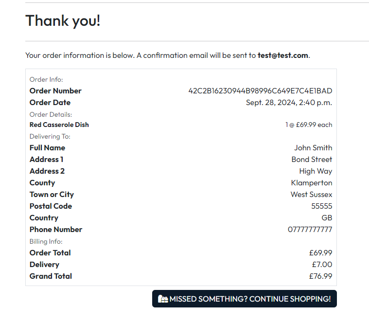

## **HomeNest**

[View the deployed project here](PLACEHOLDER FOR PROJECT)

## **Site Overview**

HomeNest is an online e-commerce store selling all different types of homeware. Users are able to browse and purchase homeware directly through the website, make an account to keep track of their order history, leave reviews for products they have purchased and contact the company via a contact form.

## **Table of contents**

## **Planning stage**

### **Target Audiences**

- Users in need of homeware for their new home
- Users in need of homeware to refurbish their home
- Users in need of homeware as a gift for a friend or relative
- Users in need of homeware for an office or workplace (kitchen appliances etc)

### **User Stories**

**As a new user, I want to**:

1. Immediately understand the site's purpose
2. Easily navigate the website
3. Browse all available products
4. Filter products to quickly find what I need
5. Search for products
6. Contact the company for help or advice
7. Purchase products without registering for an account
8. Browse product reviews left by other users
9. Stay informed on actions I take throughout the website
10. Receive confirmation of my order
11. Access the site on any device
12. Create and log into an account

**As a registered user, I want to**:

13. View my profile page
14. View my previous order history
15. View and update my personal information
16. Create reviews for products I've purchased
17. View reviews for products I've purchased
18. Update reviews for products I've purchased
19. Delete reviews for products I've purchased
20. Change my password
21. Make purchases without filling in my personal information each time
22. Logout of my account

**As an admin, I want to**:

23. Add new products to the store
24. Update existing products
25. Delete existing products
26. Delete existing reviews

### **Site Aims**

- Offer a simple and responsive e-commerce store where users can purchase homeware items quickly and easily.
- Offer the ability to register an account, allowing the user to see their previous order history, manage personal information and leave reviews for products they have purchased.
- To keep the user informed as they navigate the store, providing confirmation of successful actions taking and warning them when something hasn't worked the way they would expect.
- To allow the user the ability to message the store via a contact form if they need help or advice.

### **Wireframes**

The original wireframes for the main pages of the store can be found below. During development, a few decisions were made to change the original structure.

- **Home Page**: The welcome heading and text was moved into the main image underneath the navigation to give this area more substance and make it one of the first things the user can see upon entering the store.
- **Product Detail Page**: Instead of using Bootstrap cards to display existing review, I opted to use the Bootstrap accordion instead as the cards would be quite big, and also I could incorporate the stores color theme into the accordion in a more aesthetic way than a card. I felt the overall flow of the page was better as a result.
- **Contact Page**: A few minor label changes for the input fields, plus the addition of the company contact details should the user wish to contact them by phone, email or visit directly. These details are already in the footer, however as one of the essential pieces of information if a user needs help or advice, I felt it was a good idea to include it on the contact page as well.

 

Home Page

 

 

Profile Page

 

 

Contact Page

 

 

Products Page

 

 

Product Detail Page

 

 

Shopping Bag

 

 

Checkout Page

 

 

Order Confirmation Page

 

### **Color Scheme**

- Navy: #0D1B2A
- Blue: #415A77
- Black: #000
- White: #fff
- Grey: #d5d5d5 (used when hovering navigation links)

The [WCAG Color Contrast Checker](https://accessibleweb.com/color-contrast-checker/) was used to ensure that any navy/blue and white/grey combinations were suitable for use.

## **Typography**

I decided to import and use the Outfit font using Google Fonts for the store, with Helvetica and sans-serif acting as the back up fonts should the Outfit import fail.

I wanted to choose a font which wasn't mainstream and unique, but also smart and representative of the professional yet fun nature of the store. It worked well with lowercase and uppercase letters, special characters and numbers when tested on the Google platform prior to importing.

## **Features**

### **Features common to all pages**

**Navigation**

- **Search bar**: Users are able to search for products quickly and easily. If nothing is entered into the search bar but the user still clicks the search button, they receive a message informing them they didn't search for anything. The search functionality finds results that match the product name or description, to give the user the best chance of finding what they need.
- **Logo**: The In Home logo was designed to be instantly recognisable as a logo for a home store. Clicking the logo returns you to the home page.
- **My Account**: The options that appear within the dropdown that appears when My Account is clicked depend on whether or not the user is logged in, and also if the user is a superuser. If the user is not logged in, they will see register and login options. If the user is logged in, they will see my profile and logout. If the user is also a superuser, the superuser will see the add new product button.
- **Shopping Bag**: The shopping bag shows the user their current bag total, and when clicked takes them to the shopping bag page.
- **Main nav links**: The blue navigation bar contains the main site navigation allowing the user to browse through the site efficiently. A home button was included so the user can always return home regardless of where they are on the website. To find products, users can shop by category, or use the all products list to view all products, with or without a sorting choice.
- **Free delivery banner**: A free delivery banner was included to ensure the user is always aware of the minimum spend to receive free delivery. This incentivizes them to spend more if they are close to the free delivery threshold.

 

**Mobile Navigation**

- **Burger icon**: On smaller devices, the main navigation bar is collapsed within the burger icon on the left.
- **Search**: While the search functionality for the search feature works exactly the same when used, the search bar itself appears as a dropdown when the search button is clicked on smaller devices for a better user experience.
- **Other links**: The other links including the logo, my account and shopping bag work the same as above.

 

**Footer**

- **Quick links**: Quick links are provided for the user so they can quickly access the products they are looking for via the footer.
- **Contact Us**: The store address, telephone number and email address are displayed on all pages so the user is able to contact the store directly very easily.
- **Social Media Links**: Social media links are displayed for users who wish to follow the store on social media via Facebook, Instagram and/or YouTube.

 

**Messages**

- This box appears when a message is sent to the user to inform them about a successful or unsuccessful action they have taken on the website.
- **Success message**: This message appears when the user has successfully completed an action including adding an item to their shopping bag, placing an order, submitting a contact form enquiry and logging in/out. If the user has items in their shopping bag, they will also see a link to advance to the checkout. In addition, if they haven't spent enough to qualify for free delivery, they are informed about how much more they need to spend to reach the threshold.
- **Warning message**: This message appears when the user needs to be warned about an action they have taken on the site.
- **Info message**: This message appears when the user needs to be given information about an action they have taken on the site.
- **Error message**: This message appears when the user needs to be informed of an error with an action they have taken.

### **Other Features**

**Home Page**

- This is one of the first things the user will see when entering the site. The wording and main image help the user to immediately understand the purpose of the website. A shop now button is included so the user can start shopping quickly and easily. This directs them to the all products page.

 

- To give the user a more specific understanding of what the store offers, the categories are neatly displayed next so the user can immediately start shopping by category if they know what area of their home they wish to buy for.

**Products page**

- **Sorting**: Users are able to sort products on any products page using various parameters. If sorting by rating, products with a rating are shown first, with all products without a current rating following behind.
- **Product layout**: On larger devices the site makes the most of the width showing 4 products in a single row. The amount of products in a single row reduces as the screen/device becomes smaller. Even on small devices, two products sit on a single row to stop the user from having to scroll down very far to see all products on the page. All details can be clearly seen even with two products in a single row.
- **Rating**: The product rating (if any) is calculated based as an average of all review ratings submitted for that product to date.
- **Link to product**: When hovering over the product image, name or price, the name and price are underlined to make it clear to the user that if they click now they will open the product. If they hover over the category, only the category is underlined which links to the relevant category page.

**Product detail page**

- **Image**: On click, a new tab opens showing an enlarged version of the product image.
- **Price**: The product price is very important and is clearly shown so the user can decide if they can afford to purchase the item.
- **Category**: The category which the product belongs to is displayed with a relevant icon. If clicked, the user is taken to that category to view more products if they wish.
- **Rating**: The product rating (if any) is also displayed for the user here as well as on the products page.
- **Edit/Delete product**: The superuser is shown buttons to edit and delete products, allowing them to manage product listings directly on the site rather than using the admin panel. If the user clicks delete, a modal is displayed asking if they are sure they wish to delete the product, in case they didn't mean to click it.
- **Description**: The product description provides more details about the product being views should the user want more details that aren't provided in the product name.
- **Quantity select**: The user is able to select a quantity for any product provided the value is between 1 and 99. The buttons provided to the user automatically stop them from entering a value outside of this range. If the user manually types in a value which is outside of this value and attempts to add the product to the shopping bag, they will be told to enter a value within the 1-99 range. In addition, if the user already has a given quantity of the same product in their shopping bag and attempts to add a further quantity via the product detail page which brings the shopping bag quantity above 99, they are informed that the shopping bag quantity has been set to the max value allowed of 99.
- **Buttons**: The user can go back to the products page with the keep shopping button, or add the product to their shopping bag with the add to bag button. Using the add to bag button will trigger a message to let the user know what the outcome of their action was.

**Reviews (Product detail page)**

- Users who are logged in are provided with a form to leave a review for a product listed on the website. They can enter their feedback and also a product rating and submit the review to be displayed for all other users to see. The form can only be submitted if there is data entered into the feedback box and also a rating is chosen, if not the user is prompted with a pop up telling them they must do so before submitting.
- If a user has already left a review of the current product, submitting the form again will update their existing review. They are given this option in case they changed their mind about the product. This also stops a disgruntled customer from leaving multiple bad reviews, which would seriously affect the product rating unfairly.
- If the user is not logged in, the form is not displayed but they are shown a message asking them to login or register to leave a review, along with login and register links to speed the process up for them and saving them having to find the links to those pages elsewhere.
- Once a review is submitted, it is shown in the list below the form (see below for more on this).

 

- All reviews that are submitted are shown in the reviews list below the form, for all users to see. They are stored within a Bootstrap accordion to save space on the page and organise them nicely.
- If the review belongs to the logged in user, they are able to delete it if they wish. The superuser can also delete any reviews left on the website, in case a user submits something with inappropriate language etc. If the user clicks delete, a modal is displayed asking if they are sure they wish to delete the review, in case they didn't mean to click it.
- If no reviews have been submitted, the list isn't shown and a message appears to say no reviews have been submitted yet.

**Shopping bag**

- The shopping bag page contains the items the user has added to their bag while browsing the site. If no items have been added, a message appears to tell the user the bag is empty and shows a button to go back and keep shopping.
- **Quantity / Update**: The user is able to increase and decrease the quantity of any particular item in their shopping bag and update the total using the update button. There are checks/validation in place to stop the user from generating a quantity less than 1 or greater than 99. If they try to bypass this, they are shown a message to inform them that the quantity has been set to the nearest possible quantity to their original entry attempt.
- **Remove item**: Users are also able to remove items from the shopping bag completely, using the remove button.
- **Product image**: The product image is a link to the product they click on, in case they want to go back to it.
- **Subtotal**: The subtotal for each product is automatically updated each time the user updates the quantity for that given item.
- **Free delivery threshold**: If the user is below the £100 free delivery threshold, a small red message appears to let them know how much more they can spend to get free delivery.
- **Buttons**: A button is included to keep shopping if the user wishes, otherwise they can proceed to the checkout.

**Checkout**

- The checkout form contains all of the required details needed from the user to process their order. Including their full name, email address and delivery information.
- **Save info**: A checkbox is included giving the user the option to save their information to their profile. If they opt for this, the next time they place an order, their details are automatically pre-filled. They can update this information on their profile page if they wish. If the user is not logged in, they are shown a message prompting them to login or register to save their information.
- **Stripe**: The store uses stripe to process it's payments. Once the complete order button is clicked, a loading spinner is displayed until the order is processed successfully, which aims to prevent the user from exiting the checkout while the store processes their payment. The user is shown a small warning message to let them know how much their card will be charged.

 

- The user is also shown a summary of their order on the checkout page, just so they are kept informed of what they are about to order. If they spot a mistake at this point, they can go back and adjust their shopping bag before completing the order and submitting payment.

**Checkout Confirmation**

- Once the user submits an order successfully, they are shown a confirmation page containing their order details, delivery and billing information.
- **Email**: A confirmation of their order is also sent to their email address containing their order details.
- **Order number**: The order number provided is unique to that particular order so it can be easily and uniquely referenced later if needed.
- **Continue Shopping**: If the user wishes to continue shopping for more products, they can use the button provided to be redirected to the products page.

 

- In addition to the order confirmation provided above, and the email the user received, they are also shown a success message in the top right hand corner just to give them the extra confidence that their order was successfully submitted.

**Login page**

- The login page is where the user is able to login to their pre-registered account. If the user doesn't have an account already, they are able to register for one using the link provided. They can also reset their password if they can't remember it.

**Sign up page**

- The sign up page is where the user is able to create an account. Users must enter matching email addresses and passwords as part of the validation. The site will also inform them if they try to use a username which is already in use. If the user tries to signup for an account using an email address which is already in the database, an email will be sent to that email address to inform the person who has access to it, in case someone it trying to commit fraud.

**Password reset page**

- This page allows the user to reset their password if they have forgotten it, so the user doesn't have to sign up for another account if they've just forgotten their password.

**Change password page**

- This page allows the logged in user to change their password if they wish. This is useful if they believe someone is trying to get access to their account and personal information.

**Add a product**

- This page is only accessible by the superuser, so customers without permission are not able to access this page via the product detail page or by entering the /products/add/ into the URL bar.
- Here, the superuser can add products to the store, selecting all of the relevant product details without having to access the admin panel.

**Edit product**

- This page is only accessible by the superuser, so customers without permission are not able to access this page via the product detail page or by entering the /products/edit/ into the URL bar.
- Here, the superuser can edit existing products in the store.

